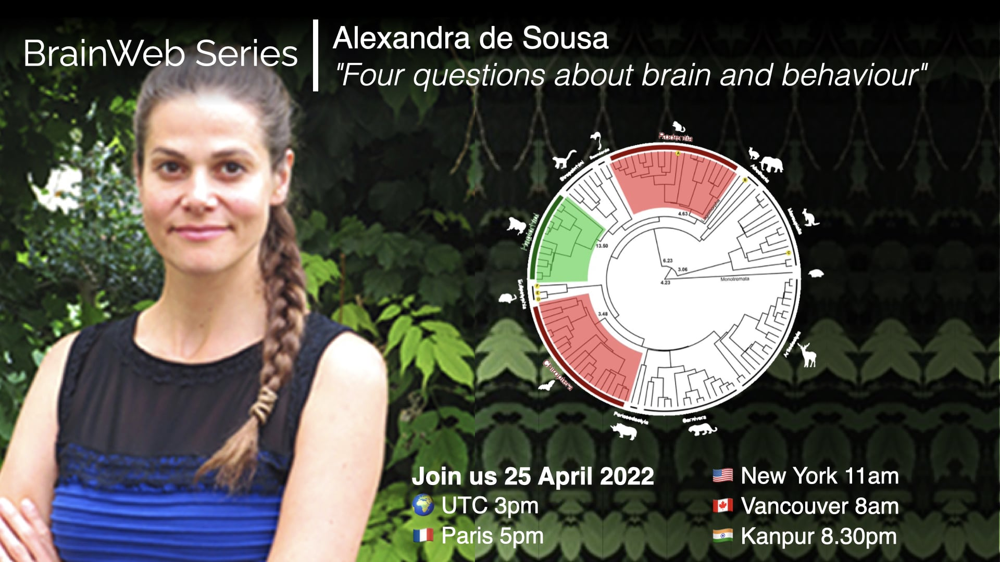
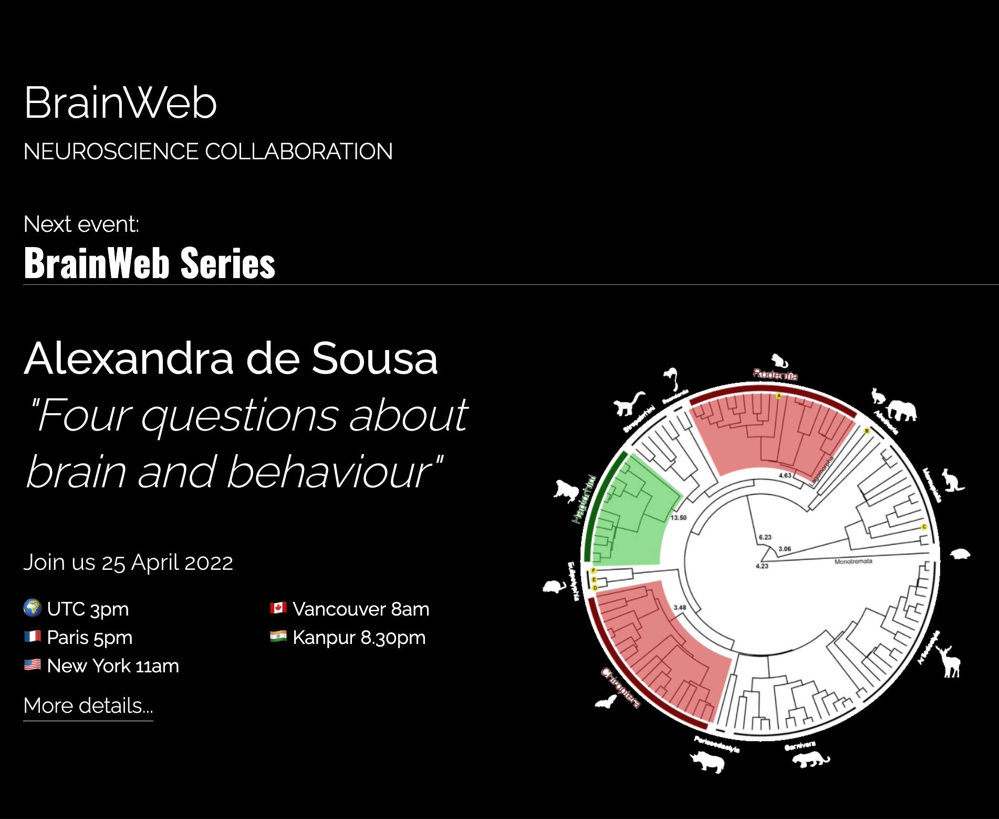

# The BrainWeb Series

The BrainWeb Series will host an invited speaker every month aiming at lively discussions and creating interconnections beyond our labs between topics of our interest around evolution, development, philosophy, art, physics, computational geometry, computational neuroscience, neuroinformatics, and more!

## The BrainWeb Youtube Channel

Past talks will be available on the [BrainWeb Youtube channel](https://www.youtube.com/channel/UCcu7c8bn6mU1YtwnRK7gQwQ).

## The BrainWeb Series Talks

Talks will happen in the [BrainWeb Videoconferencing space](https://brain-web.github.io/videoconference).

### Events
### [**25.04.2022: Alexandra de Sousa**](https://brain-web.github.io/#events)

<!-- </img> -->

